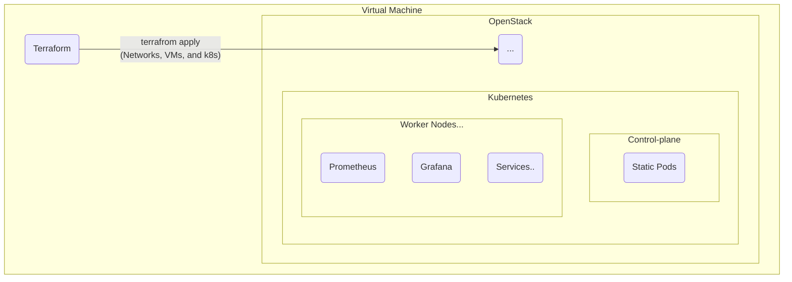

# Terraform Openstack K8S

## About



Install Network, VM, K8S on OpenStack using Terraform Openstack Provider. Configure the monitoring system within the k8S cluster.

## Requirements

* Run 2VMs on DevStack. Tested on 16Core 32GB RAM(at least 8Core 16GB).
* Install devstack on ubuntu 22.04 server
  * This is a stack directory [compressed file](https://drive.google.com/file/d/1yv-SR6p6TdwcbZN4vAIfPT4vsBryrIRf/view?usp=share_link). I checked that it works well when I moved the file to another server and reinstalled it.
  * ```bash
    ./unstack.sh
    ./clean.sh
    ./stack.sh
    ```
* Create a OpenStack VM with a custom image(ubuntu-minimal-22.04). Access the OpenStack web and upload the created image. The image name is [k8s-image-1.0.0](https://drive.google.com/file/d/1FXnDuJNNbDzedOrzrQBRkYwSUxx5veiP/view?usp=share_link).
  * The base image has kubeadm, kubectl, kubelet, and helm, net-tools, and ping installed to create the K8S.
* Create a ssh keypair in the home directory.
  * ```bash
    sudo rm -rf ~/.ssh/id_rsa*
    ssh-keygen -t rsa -b 4096 -q -N "" -f ~/.ssh/id_rsa
    ```
* Environment variables are required for authentication in Terraform.
  * ```bash
    cd ~/devstack
    openrc admin admin
    env | grep OS_
    ```
* OpenStack bridge network may go down upon reboot. Add the command below to .bashrc.
  * ```bash
    sudo ip addr flush dev br-ex
    sudo ip addr add 172.24.4.1/24 dev br-ex
    sudo ip link set br-ex up
    sudo route add -net 10.0.0.0/24 gw 172.24.4.1
    
    sudo iptables -I FORWARD -j ACCEPT
    sudo iptables -t nat -I POSTROUTING -s 172.24.4.0/24 -j MASQUERADE
    ```
    

## Getting Started

```bash
# in devstack server..
git clone https://github.com/PARKINHYO/terraform-openstack-k8s.git
cd terraform-openstack-k8s
terraform init
terraform apply --var-file '.tfvars' --auto-approve
```

Prometheus, Grafana consists of Cluster IP Service. Use the `port-forward` command or modify the resource with NodePort.

You can install ubuntu-desktop and access k8s resources with chrome in openstack.

```bash
sudo apt-get install ubuntu-desktop -y
sudo apt install wget -y
wget https://dl.google.com/linux/direct/google-chrome-stable_current_amd64.deb
sudo dpkg -i ./google-chrome-stable_current_amd64.deb
```

Or below is a command to forward from a DevStack VM to a VM created with DevStack.

```bash
iptables -t nat -A OUTPUT -p tcp -d [requested-ip] -j DNAT —to-destination [target-ip]
```


## Demo

https://www.youtube.com/watch?v=ed9LxTkhQb4

